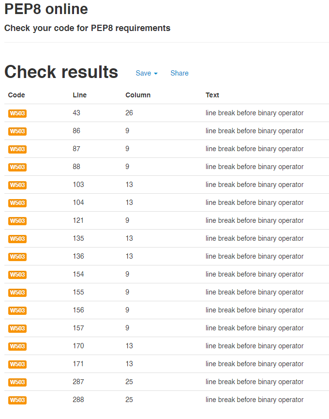
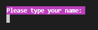
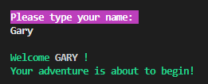

Welcome to my third Code Institute diploma project.

# INTRODUCTION AND OVERVIEW
For my third project I decided to create a ***choose your own adventure*** style text game.

'**Virtual House**' is a choose your own adventure style game where the user has to choose the correct path to a 'Safe Room'.  The project was developed using the Python programming language to create a command line application that hopefully demonstrates my learning.

# VIRTUAL HOUSE


### **Live Project can be viewed:**  [HERE](https://garycooper-pm.github.io/PP3-Python-project/)

### **The repository can be found here:**  [HERE](https://github.com/GaryCooper-pm/PP3-Python-project)


## INITIAL IDEA CONCEPT

My initial idea for this project was to create a simple choose your own adventure style game that was inspired by my childhood reading of the [Steve Jackson and Ian Livingstone Fighting Fantasy books](https://en.wikipedia.org/wiki/Fighting_Fantasy) and playing the [1982 ZX Spectrum computer game - The Hobbit](https://en.wikipedia.org/wiki/The_Hobbit_(1982_video_game)).

 


## FLOWCHART (SPOILER)


#
## CONTENTS


- [USER STORY](#user-story)
- [FEATURES](#features)
    - [Future Features](#future-features)
    - [Typography](#typography)
- [TESTING](#testing)
    - [User story testing](#user-story-testing)
    - [Validation](#validation)
    - [Manual testing](#manual-testing)
    - [Unsolved bugs and problems](#unsolved-bugs-and-problems)
- [TECHNOLOGIES](#technologies)
    - [Development](#development)
    - [Languages used](#languages-used)
    - [Libraries used](#libraries-used)
- [DEPLOYMENT](#deployment)
- [ACKNOWLEDGEMENTS](#acknowledgements)

#

## USER STORY

* As a user I want the game to be fun to play
* As a user I want an element of luck
* As a user I want an element of suspence

---

## FEATURES

### Future Features:

* Add more descriptive detail to the rooms
* Add more rooms to the game to prolong gameplay
* Add ability to collect and use items along the way
* Add the option to play again


### Typography:

* The project utilises [PATORJK.COM](https://patorjk.com/software/taag/#p=display&f=Roman&t=Sample%20Text) for the ascii art used for the (titles and room names).
* Otherwise it was the standard terminal font.

---

# TESTING

## User story testing

* `As a user, I want to easily understand the main purpose of the game`:
    * Once the user has entered his/her name,
        there will be a paragraph on what the game entails.  Outcome: `Fulfilled.`

* `As a user, I want to easily understand the required input to play`:
    * The terminal window displays the required input,
        this is in the form of the choice of doors to enter.  Outcome: `Fulfilled.`

* `As a user, I want to easily understand if I have won or lost the game`:
    * The terminal window displays the appropriate message,
        this is in the form of a messge saying you proceed to the next room,
        or the appropriate end screen.  Outcome: `Fulfilled.`


## Validation
### PEP8 Online Validation

Python code was passed through the [PEP8 online](http://pep8online.com/) code checker.




## Manual Testing

* After the initial loading screen the user is asked to enter their name.



* Once they have typed their name the program converts the user input to UPPERCASE text and welcomes them to the game.



* After a short pause the terminal window clears and the introduction begins to type out and the adventure begins.


* In order to proceed the user must type the correct response as prompted.

    * Player response validation - incorrect input

    

    * Player response validation - correct input
    
    


* Once they press the 'ENTER' key and after a short pause the terminal window clears.

* With each room visited the user is greeted with the room name and is faced with a choice of doors to enter.

* If the user chooses the incorrect door they are met with a 'GAME OVER' screen and the game ends.

* If the user chooses the correct door they will either proceed to the next room or the 'SAFE ROOM' where the user is congratulated and the game ends.


## Unsolved bugs and problems

* I currently have 43 problems with my code as detailed in the screenshot below.


---

# TECHNOLOGIES

## DEVELOPMENT

* The project was written and tested using [Gitpod](https://gitpod.io/)
* The project uses [Github](https://github.com/) for utilising git version control
* The project was deployed via [Heroku](https://heroku.com/)


## LANGUAGES USED

* The project was written using [PYTHON3](https://en.wikipedia.org/wiki/Python_(programming_language))

## LIBRARIES USED

* Os
    - os was imported to provide functionality to interact with the operating system.

* Time
    - time was imported to provide the ability to add delays to the game using the ```sleep()``` function.

* Sys
    - sys was imported for the exit of the game.

* Colorama
    - colorama was installed to enable to change the terminal text color.


---

# DEPLOYMENT

## Heroku

* This Game was deployed using [Heroku](https://heroku.com/) with the following the steps:

1. Navigate to [Heroku.com](https://www.heroku.com/) and log-in or create a new account.
2. On the top right hand side, click the 'New' button.
3. Inside the dropdown menu, select 'Create new app'.
4. Create a new name for your app (making sure the name chosen is available) in this case it is `numberex`.
    App names can only be in lower-case letters, numbers and dashes.
5. Select your region, in this case, `Europe`.
6. Click on the `Create App` button.  
7. This will create your app in Heroku and take you to the [Heroku](https://heroku.com/) dashboard.
8. Navigate to the settings tab and scroll down to the button `Reveal Config vars`.
9. Replace the word `KEY` and enter `PORT` and then replace the word `VALUE` and enter `8000` then click on the `Add` button.
10. Below `Config vars` is `Buildpacks`. Click the `Add Buildpack` button.
11. In the pop up window, select `python` and save changes.
12. Repeat this again but this time selecting `node.js` and save the changes.
13. It is `important` to make sure the buildpacks are in the correct order 
    with `Python` being at the top and `node.js` bottom. If they are not in the correct order, you can drag them into the right order.
14. Next, navigate to the `Deploy` tab at the top left side.
15. Select `Github, 'connect to github'` as the deployment method.
16. Search for the Github Repository in the search field (in this case `Python_PP3`) and click `Search`.
17. When the search is complete, click `connect`.
18. Once your repository is connected to [Heroku](https://heroku.com/), Click the `Enable Automatic Deploys` button for automatic deployment.
19. Alternatively you can manually deploy by selecting a branch to deploy from and clicking `Deploy Branch`.
20. If you choose to `Enable Automatic Deploys`, [Heroku](https://heroku.com/) will build a new version of the app when a change to 
    `gitpod` is pushed to `Github`.  
21. Manual deployment allows you to update the app whenever you click `Deploy Branch`.
    In the case of this project, I chose to `Enable Automatic Deploys` to ensure the code was deployed straight away at each push from `Gitpod`.
22. Once the build process is complete (this can take a few seconds) you will then be able to view the live app by clicking on the button `View`
    below `Your app was successfully deployed`.

## Version control

* These commands were used for version control during project:

    * git add `example filename` - to add files before committing
    * git commit -m `"example message"` - to commit changes to the local repository
    * git push - to push all committed changes to the GitHub repository
    * git branch - to see which branch currently working on
    * git pull - to pull all code into main branch once the feature branch had been merged and deleted
    * git status - to see if the branch currently working on is upto date or if the are any unstaged
    * git log --oneline - to see the last commit
    * git commit --amend - to amend the most recent commit message

## How to create a branch/Tag of main:

If you need to `BRANCH` off of the main repository:

1. If you have not already, login in to [GitHub](www.github.com) and go to https://github.com/GaryCooper-pm/
2. On the left side of the screen underneath the nav links, click the drop down box `Main`
3. Inside the box you will see `Create new branch/tag`
4. Inside the text box, enter the new branch or tag name i.e., `Features`
5. Below the Branches Tags tab, you will see `Create branch: Features from "main"`
6. Click on `Create branch: Features from "main"` and you will be taken to the new branch page you just called `Features`

## How to fork a repository:

If you need to `FORK` a repository:

1. If you have not already, login in to [GitHub](www.github.com) and go to https://github.com/GaryCooper-pm/
2. In the top right corner, click `Fork`
3. The next page will be the forked version of https://github.com/GaryCooper-pm/ but in your own repository
## How to clone a repository:

If you need to make a clone of this repository:

1. Fork the repository https://github.com/GaryCooper-pm/ using the steps above
2. Above the file list, click `Code` (Usually green at the top right of the code window)
3. Choose if you want to clone using HTTPS, SSH or GitHub CLI, then click the copy button to the right
4. Open Git Bash
5. Change the directory to where you want your clone to go (your own github)
6. Type `git clone` and then paste the URL you copied in step 4
7. Press `Enter` to create your clone

## How to make a local clone:

If you need to make a local clone:

1. If you have not already, login in to [GitHub](www.github.com) and go to https://github.com/GaryCooper-pm/
2. Under the repository name, above the list of files, click `Code`
3. Here you will have two options, `Clone` or `Download` the repository
4. You should close the repository using HTTPS, clicking on the icon to copy the link
5. At this point, you can launch the `Gitpod workspace` or choose your own directory
5. Open Git Bash
6. Change the current working directory to the new location of where you want the cloned directory to be
7. Type git clone and then paste the URL you copied in step 4
8. Press Enter, to create your local clone to your chosen directory


---

## ACKNOWLEDGEMENTS

* Community over on Stack Overflow for code inspiration to create the 'typewriter text effect.
```
for line in intro:
        for character in line:
            print(character, end="")
            sys.stdout.flush()
            sleep(0.105)
```
* pypi.org for the Colorama module

* Jason Ault over on YouTube for his explanation and code on how to resolve the issue of calling a function within a function.
```
eval(next_rooms[choices.index(command)] + "()")
```

* Code formatting courtesy of [Black](https://pypi.org/project/black/)

 [](https://github.com/psf/black)

 * ANSI escape codes for coloring the ASCII art courtest of [HAOYI'S PROMGRAMMING BLOG](https://www.lihaoyi.com/post/BuildyourownCommandLinewithANSIescapecodes.html#background-colors)
```
COLORS = {
    "yellow": "\u001b[33;1m",
    "red": "\u001b[31m",
    "blue": "\u001b[34;1m",
    "magenta": "\u001b[35m",
    "white": "\u001b[37m",
}
```
 * Text to ASCII Art converter courtesy of [PATORJK.COM](https://patorjk.com/software/taag/#p=display&f=Roman&t=Sample%20Text)

---


## Reminders

* Your code must be placed in the `run.py` file
* Your dependencies must be placed in the `requirements.txt` file
* Do not edit any of the other files or your code may not deploy properly

## Creating the Heroku app

When you create the app, you will need to add two buildpacks from the _Settings_ tab. The ordering is as follows:

1. `heroku/python`
2. `heroku/nodejs`

You must then create a _Config Var_ called `PORT`. Set this to `8000`

If you have credentials, such as in the Love Sandwiches project, you must create another _Config Var_ called `CREDS` and paste the JSON into the value field.

Connect your GitHub repository and deploy as normal.

## Constraints

The deployment terminal is set to 80 columns by 24 rows. That means that each line of text needs to be 80 characters or less otherwise it will be wrapped onto a second line.

-----
Happy coding!
